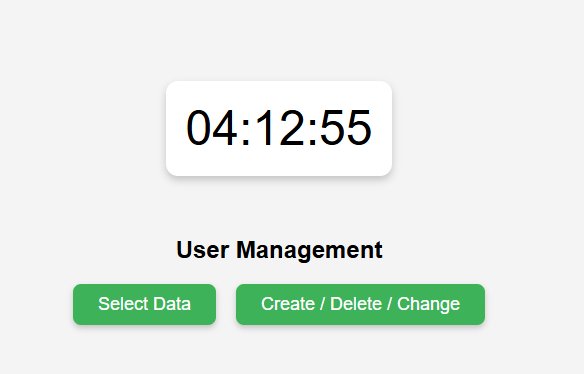
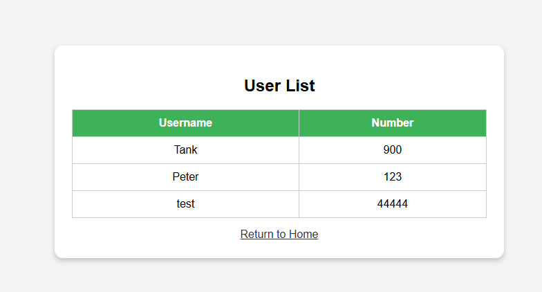
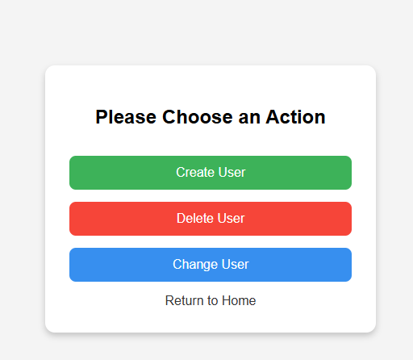
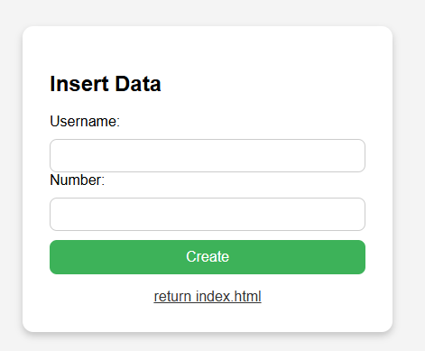
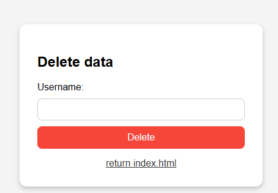
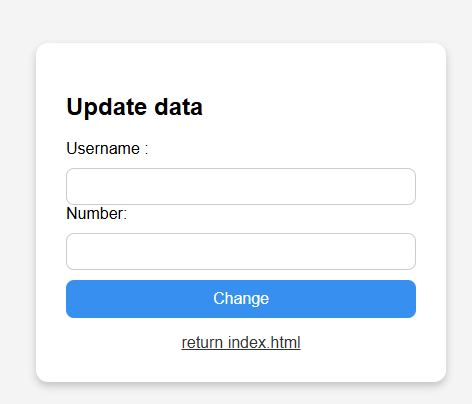

# Web_code_introcude
此文件為TankLee練習用，如有需要請自行使用<br>
This document is for TankLee training some full-stack engineer skill.<br>

## Website and Database
Assuming that two containers have already been created.<br>
In this example we use php to connect database to select,create,delete.<br>
some example code
```
#test.php
<?php
    echo "<br>";
    $host = '10.5.0.6'; # database ip 
    $dbuser = 'tank'; # database user
    $dbpassword = 'tanklee'; # database user pwd 
    $dbname = 'user_test'; # use database
    $link = mysqli_connect($host,$dbuser,$dbpassword,$dbname); # mysql connect link
    if($link){
            echo "successfuel<br>";
            mysqli_set_charset($link, "utf8mb4");
            $sql = "SELECT * FROM user where 1";
            $result = mysqli_query($link,$sql);
            while($row = mysqli_fetch_assoc($result)){
                    #print_r($row);
                    echo "Name is :" . $row["name"] . " number is : " . $row["number"];

                    echo "<br>";
            }
    }else{
            echo "\nerror";
    }
?>
```
Above file only show select, now we create html/php cooperative file do other database operation.<br>

```
#html
<html>
    <head>
        <meta charset="utf-8">
    </head>
    <body>
        <h2>Insert Data</h2>
        <form method="post" action="action.php">
                Username: <input type="text" name="name"><br>
                Number: <input type="text" name="number"><br>
                <input type="hidden" name="action" value="create">
                <button type="submit">Create</button>
        </form>
     <a href="index.html">return index.html</a>
     </body>
</html>
```
```
#php
<?php
        $link = mysqli_connect("10.5.0.6", "tank", "tanklee", "user_test");
        mysqli_set_charset($link, "utf8mb4");
        if (!$link) {
        die("connection failed");
        }else{
	        echo "connection successful<br>";
        }
        $action = $_POST["action"];
        $name = $_POST["name"];
        $number = $_POST["number"];  
        
        $stmt = null;
        switch ($action) {
            case 'create':
                $sql = "INSERT INTO user (name, number) VALUES (?, ?)";
                $stmt = mysqli_prepare($link, $sql);
                mysqli_stmt_bind_param($stmt, "si", $name, $number);
                $msg = mysqli_stmt_execute($stmt) ? "create OK" : "create failed";
                break;

            case 'delete':
                $sql = "DELETE FROM user WHERE name = ?";
                $stmt = mysqli_prepare($link, $sql);
                mysqli_stmt_bind_param($stmt, "s", $name);
                $msg = mysqli_stmt_execute($stmt) ? "delete OK" : "delete failed";
                break;

            case 'change':
                $sql = "UPDATE user SET number = ? WHERE name = ?";
                $stmt = mysqli_prepare($link, $sql);
                mysqli_stmt_bind_param($stmt, "ss", $number, $name);
                $msg = mysqli_stmt_execute($stmt) ? "update OK" : "update failed";
                break;

            default:
                $msg = "undefined action";
        }
        if ($stmt) {
            mysqli_stmt_close($stmt);
        }
        mysqli_close($link);
        echo "<h3>{$msg}</h3>";
        echo "<a href='index.html'>return index.html</a>";
?>
```
Now, I want design a clock and automate running to change time.<br>
Its can use js to achieve.<br>
```
#html
<div id="clock">Loading...</div>
#js
  <script>
    function updateClock(){
        # get current time 
        let now = new Date();
        let hrs = String(now.getHours()).padStart(2, '0');
        let min = String(now.getMinutes()).padStart(2, '0');
        let sec = String(now.getSeconds()).padStart(2, '0');

        let timeString = hrs + ":" + min + ":" + sec;
        # js configure element clocl text change to current time 
        document.getElementById('clock').textContent = timeString;
    }

    updateClock();
    # js update time interval 
    setInterval(updateClock, 1000);
  </script>
```
The file is put in source folder.<br>
### index

### select 

### choice operation

### insert

### delete

### update

